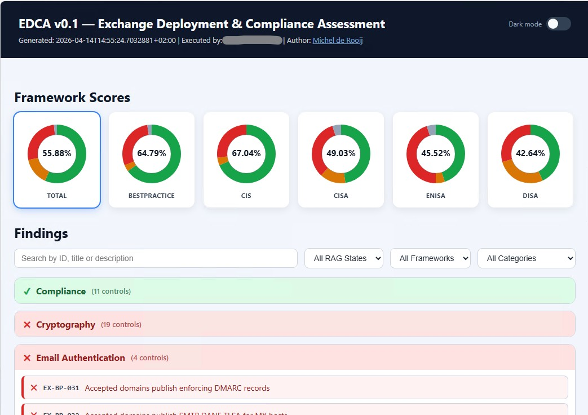

# EDCA — Exchange Deployment & Compliance Assessment

PowerShell-based tool to collect Exchange on-premises deployment data, evaluate it against best-practices and well-known compliance controls, and produce an interactive HTML report. Supported are Exchange 2016, Exchange 2019, and Exchange SE.

## Features

- `-Collect` switch to gather data from Exchange servers and write JSON files to the Data folder.
- `-Report` switch to read JSON files from a prior collection run (default: `.\Data`) and generate an HTML report.
- When neither `-Collect` nor `-Report` is specified, both phases run by default.
- Interactive HTML dashboard with scores for Best Practice, ENISA/NIS2, CIS, DISA, and CISA.
- External controls catalog in `Config/controls.json`.
- Optional remediation script generation for all failed controls.
- Supports Exchange 2016, Exchange 2019, and Exchange SE.
- Collection and analysis output stored in Data folder (default).
- Report and remediation stored in Output folder (default).
- `-Update` switch to download the latest Exchange build catalog from GitHub before running.
- HTML report respects system dark mode preference (`prefers-color-scheme`).
- Markdown formatting in control descriptions and evidence is rendered to HTML in the report.

## Requirements

- PowerShell 5.1 or later.
- Execution under an account that has Exchange and AD administrative access as required.
- Exchange Management Shell nor Active Directory module are required on the system.
- EDCA uses remoting sessions to the Exchange servers through http (80).
- EDCA uses LDAPS to Domain Controllers with the Global Catalog role (3269), and CIM uses WS-MAN (5985) to read CPU details.

## Required Permissions

The account running EDCA needs the following access rights. Rights marked **required** affect core collection; rights marked **needed for** affect specific controls only and will cause those controls to report **Fail** if missing.

| Permission | Scope | Required for |
|---|---|---|
| Exchange **Organization Management** or **View-Only Organization Management** role | Exchange organization | Core collection — Exchange cmdlets (`Get-ExchangeServer`, `Get-OrganizationConfig`, `Get-Mailbox`, and all other Exchange management commands). |
| **Local Administrator** | Each Exchange server | Core collection — WMI queries for OS, hardware, volume/disk, BitLocker state, network configuration; reading local registry values (TLS, update metadata). |
| **Active Directory read** (Domain User is sufficient) | AD forest/domain | Core collection — LDAP RootDSE queries for forest and domain functional level; AD site enumeration (`EX-BP-009`); Exchange server AD site lookup. |
| **Local Administrator** | Each Domain Controller / Global Catalog in the Exchange AD site | `EDCA-PERF-012` (Exchange-to-DC/GC core ratio) — WMI `Win32_Processor` on domain controller servers. |

> **Note:** If the required permissions are not in place, affected controls will report **Fail** rather than *Unknown* so that missing access is surfaced as a finding rather than silently skipped.

## Usage

From the `EDCA` folder:

```powershell
# Update exchange build catalog, then collect + analyse + HTML (default: both phases)
.\EDCA.ps1 -Update -Servers EXCH01,EXCH02

# Collect + analysis + HTML (both phases run by default)
.\EDCA.ps1 -Servers EXCH01,EXCH02

# Collect with detailed execution trace
.\EDCA.ps1 -Servers EXCH01,EXCH02 -Verbose

# Collect + analysis + HTML for all Exchange servers in current environment
.\EDCA.ps1

# Collect only (no report), limit parallel collection jobs
.\EDCA.ps1 -Collect -Servers EXCH01,EXCH02 -ThrottleLimit 2

# Collect with remediation script generation
.\EDCA.ps1 -Servers EXCH01,EXCH02 -RemediationScript

# Report mode using files from previously collected server and organization files
.\EDCA.ps1 -Report

# Analyse only against CIS and DISA controls
.\EDCA.ps1 -Servers EXCH01,EXCH02 -Framework CIS,DISA

# Report mode scoped to specific frameworks
.\EDCA.ps1 -Report -Framework 'Best Practice','CIS'
```

## Output

Collection and Analysis files are written to `Data`:

- `<fqdn>_<timestamp>.json`: Per-server collected data (machine-readable).
- `<OrganizationId>_<timestamp>.json`: Organization-wide collected data shared across all servers in the run.
- `analysis_*.json`: Control evaluation output.

Report and remediation files are written to `Output`:

- `report_*.html`: Interactive assessment report.
- `remediation_*.ps1`: Optional generated remediation script.


## Screenshots

**Report dashboard** — framework scores (Total, Best Practice, CIS, CISA, ENISA, DISA) with colour-coded donut charts, and findings grouped by category with RAG indicators, search, and filters:



**Control detail panel** — per-control description, evidence table (subject, status, evidence text), remediation guidance, and optional script template:


## Frameworks

EDCA evaluates controls against the following compliance frameworks. Each control in `Config/controls.json` is tagged with one or more framework identifiers; the HTML report displays a separate score for each.

| Framework | Full name
|---|---|
| **Best Practice** | Common best practices for Exchange Server deployments, including [CSS Exchange](https://microsoft.github.io/CSS-Exchange/) |
| **CIS** | [CIS Microsoft Exchange Server Benchmark](https://www.cisecurity.org/benchmark/microsoft_exchange_server) |
| **CISA** | [CISA Microsoft Exchange Server Security Best Practices Guide](https://www.cisa.gov/resources-tools/resources/microsoft-exchange-server-security-best-practices-guide) |
| **DISA** | [DISA STIG for Microsoft Exchange 2019 Mailbox Server](https://public.cyber.mil/stigs/downloads/) |
| **ENISA** | [ENISA / NIS2 Directive (EU) 2022/2555](https://www.enisa.europa.eu/topics/cybersecurity-policy/nis-directive-new), including [NCSC-NL TLS Guidelines](https://www.ncsc.nl/documenten/publicaties/2021/januari/19/ict-beveiligingsrichtlijnen-voor-transport-layer-security-2.1) |

## Notes

- Controls with `verify: false` are documented but excluded from scoring.
- Some controls are marked manual remediation only.
- Use `-Framework` to scope a run to one or more specific frameworks (e.g. `-Framework CIS,DISA`). Multiple values are OR-combined: a control is included when it is tagged with *any* of the specified frameworks. When omitted, all controls are evaluated.

## Changelog

### v0.3 Preview
- Control IDs renamed from `EX-BP-xxx` scheme to `EDCA-<Category>-<number>` (e.g. `EDCA-SEC-001`, `EDCA-PERF-012`).
- New controls: `EDCA-MON-001` (admin audit logging), `EDCA-IAC-025`, `EDCA-PERF-013`, `EDCA-PERF-014`, `EDCA-PERF-015`.
- HTML report now follows the system colour-scheme preference (`prefers-color-scheme: dark`) when no manual override is stored.
- Markdown syntax in control descriptions and evidence text is rendered as HTML in the report.
- Findings in the HTML report are sorted by category then by control ID.
- Exchange database/log volume block-size check now supports volumes mounted as directory paths (not just drive letters).
- Exchange build number read from the registry in addition to `Get-ExchangeServer`, improving accuracy on servers where Exchange cmdlets are unavailable.
- Server inventory collection migrated from `Get-WmiObject` to `Get-CimInstance`.
- Script block logging absent now results in **Fail** (previously **Unknown**).
- IRM not configured results in **Skipped** (previously **Fail**).
- Startup banner displayed when EDCA begins execution.
