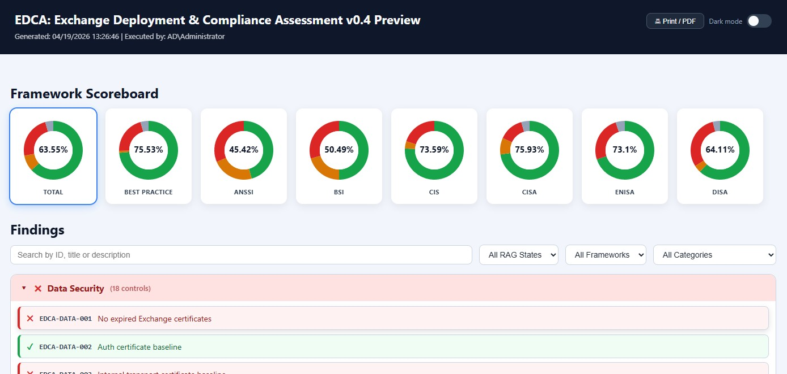
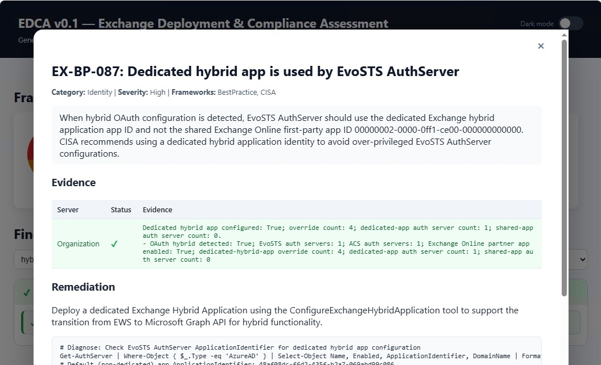

# EDCA — Exchange Deployment & Compliance Assessment

PowerShell-based tool to collect Exchange on-premises deployment data, evaluate it against best-practices and well-known compliance controls, and produce an interactive HTML report. Supported are Exchange 2016, Exchange 2019, and Exchange SE.

## Features

- `-Collect` switch to gather data from Exchange servers and write JSON files to the Data folder.
- `-Report` switch to read JSON files from a prior collection run (default: `.\Data`) and generate an HTML report.
- When neither `-Collect` nor `-Report` is specified, both phases run by default.
- Interactive HTML dashboard with scores for Best Practice, ANSSI, BSI, ENISA/NIS2, CIS, DISA, and CISA.
- External controls catalog in `Config/controls.json`.
- Optional remediation script generation for all failed controls.
- Supports Exchange 2016, Exchange 2019, and Exchange SE.
- Collection and analysis output stored in Data folder (default).
- Report and remediation stored in Output folder (default).
- `-Update` switch to download the latest Exchange build catalog from GitHub before running.
- HTML report respects system dark mode preference (`prefers-color-scheme`).
- Markdown formatting in control descriptions and evidence is rendered to HTML in the report.

## Requirements

- PowerShell 5.1 or later.
- Execution under an account that has Exchange and AD administrative access as required.
- Exchange Management Shell nor Active Directory module are required on the system.
- EDCA uses remoting sessions to the Exchange servers through http (80).
- EDCA uses LDAPS to Domain Controllers with the Global Catalog role (3269), and CIM uses WS-MAN (5985) to read CPU details.

## Required Permissions

The account running EDCA needs the following access rights. Rights marked **required** affect core collection; rights marked **needed for** affect specific controls only and will cause those controls to report **Fail** if missing.

| Permission | Scope | Required for |
|---|---|---|
| Exchange **Organization Management** or **View-Only Organization Management** role | Exchange organization | Core collection — Exchange cmdlets (`Get-ExchangeServer`, `Get-OrganizationConfig`, `Get-Mailbox`, and all other Exchange management commands). |
| **Local Administrator** | Each Exchange server | Core collection — WMI queries for OS, hardware, volume/disk, BitLocker state, network configuration; reading local registry values (TLS, update metadata). |
| **Active Directory read** (Domain User is sufficient) | AD forest/domain | Core collection — LDAP RootDSE queries for forest and domain functional level; AD site enumeration; Exchange server AD site lookup. |
| **Local Administrator** | Each Domain Controller / Global Catalog in the Exchange AD site | Exchange-to-DC/GC core ratio — WMI `Win32_Processor` on domain controller servers. |

> **Note:** If the required permissions are not in place, affected controls will report **Fail** rather than *Unknown* so that missing access is surfaced as a finding rather than silently skipped.

## Usage

From the `EDCA` folder:

# Collect + analysis + HTML for all Exchange servers in current environment
.\EDCA.ps1

# Collect + analysis + HTML (both phases run by default)
.\EDCA.ps1 -Servers EXCH01,EXCH02

# Collect only (no report), limit parallel collection jobs
.\EDCA.ps1 -Collect -Servers EXCH01,EXCH02 -ThrottleLimit 2

# Collect with remediation script generation
.\EDCA.ps1 -Servers EXCH01,EXCH02 -RemediationScript

# Report mode using files from previously collected server and organization files
.\EDCA.ps1 -Report

# Analyse only against CIS and ENISA controls
.\EDCA.ps1 -Servers EXCH01,EXCH02 -Framework CIS,ENISA

```

## Output

Collection and Analysis files are written to `Data`:

- `<fqdn>_<timestamp>.json`: Per-server collected data (machine-readable).
- `<OrganizationId>_<timestamp>.json`: Organization-wide collected data shared across all servers in the run.
- `analysis_*.json`: Control evaluation output.

Report and remediation files are written to `Output`:

- `report_*.html`: Interactive assessment report.
- `remediation_*.ps1`: Optional generated remediation script.


## Screenshots

**Report dashboard** — framework scores (Total, Best Practice, ANSSI, BSI, CIS, CISA, ENISA, DISA) with colour-coded donut charts, and findings grouped by category with RAG indicators, search, and filters:



**Control detail panel** — per-control description, evidence table (subject, status, evidence text), remediation guidance, and optional script template:



## Frameworks

EDCA evaluates controls against the following compliance frameworks. Each control in `Config/controls.json` is tagged with one or more framework identifiers; the HTML report displays a separate score for each.

| Framework | Official Reference(s) | Version / Date | Official URL | License |
|---|---|---|---|---|
| **Best Practice** | Common best practices for Exchange Server deployments, including [CSS Exchange](https://microsoft.github.io/CSS-Exchange/) | — | — | — |
| **ANSSI** 🇫🇷 | [Mise en œuvre sécurisée d'un serveur Windows](https://messervices.cyber.gouv.fr/guides/mise-en-oeuvre-securisee-dun-serveur-windows)<br>[Recommandations de sécurité relatives à TLS](https://messervices.cyber.gouv.fr/guides/recommandations-de-securite-relatives-tls)<br>[Sécuriser la journalisation dans un environnement Microsoft AD](https://messervices.cyber.gouv.fr/guides/securiser-la-journalisation-dans-un-environnement-microsoft-active-directory)<br>[Transition post-quantique de TLS 1.3](https://messervices.cyber.gouv.fr/guides/Transition-post-quantique-protocole-TLS-1-3) | v1.0 · Oct 2025<br>v1.2 · Mar 2020<br>Jan 2022<br>Feb 2026 | [messervices.cyber.gouv.fr](https://messervices.cyber.gouv.fr/) | Free to access |
| **BSI** 🇩🇪 | [IT-Grundschutz-Kompendium Edition 2023](https://www.bsi.bund.de/DE/Themen/Unternehmen-und-Organisationen/Standards-und-Zertifizierung/IT-Grundschutz/IT-Grundschutz-Kompendium/it-grundschutz-kompendium_node.html)<br>Modules: SYS.1.1 · SYS.1.2.3 · APP.2.2 · APP.5.2 | Edition 2023<br>February 2023 | [bsi.bund.de](https://www.bsi.bund.de/) | © BSI — free to download |
| **CIS** 🇺🇸 | [CIS Microsoft Exchange Server 2019 Benchmark](https://www.cisecurity.org/benchmark/microsoft_exchange_server)<br>[CIS Microsoft Windows Server 2019/2022 Benchmark](https://www.cisecurity.org/benchmark/microsoft_windows_server)<br>[CIS Controls v8](https://www.cisecurity.org/insights/white-papers/cis-controls-v8) | v1.0.0<br>v4.0.0 (2019) · v5.0.0 (2022)<br>v8 | [cisecurity.org](https://www.cisecurity.org/benchmark/microsoft_exchange_server) | Free, non-commercial use only |
| **CISA** 🇺🇸 | [Microsoft Exchange Server Security Best Practices Guide](https://www.cisa.gov/sites/default/files/publications/CSI_MS_Exchange_Security_Best_Practices_Final.pdf)<br>[Advisory AA21-062A: Mitigate Exchange Server Vulnerabilities](https://www.cisa.gov/news-events/cybersecurity-advisories/aa21-062a)<br>[Binding Operational Directive 18-01](https://www.cisa.gov/binding-operational-directive-18-01)<br>[Known Exploited Vulnerabilities Catalog](https://www.cisa.gov/known-exploited-vulnerabilities-catalog) | 2021<br>March 2021<br>October 2017<br>Ongoing | [cisa.gov](https://www.cisa.gov/) | Public domain (US Government) |
| **DISA** 🇺🇸 | [Microsoft Exchange 2019 Mailbox Server STIG](https://public.cyber.mil/stigs/downloads/)<br>[Microsoft Exchange 2016 Mailbox Server STIG](https://public.cyber.mil/stigs/downloads/) | 2025-05-14<br>2023-12-18 | [public.cyber.mil/stigs](https://public.cyber.mil/stigs/downloads/) | Public domain (US Government) |
| **ENISA** 🇪🇺 | [NIS2 Directive (EU) 2022/2555](https://eur-lex.europa.eu/eli/dir/2022/2555/oj)<br>[NCSC-NL TLS Guidelines 2025-05](https://www.ncsc.nl/transport-layer-security/ICT-beveiligingsrichtlijnen-voor-TLS) | December 2022<br>April 2026 | [eur-lex.europa.eu](https://eur-lex.europa.eu/eli/dir/2022/2555/oj)<br>[ncsc.nl](https://www.ncsc.nl/) | Open (EU law)<br>Free (Dutch Government) |

## Notes

- Controls with `verify: false` are documented but excluded from scoring.
- Some controls can be manual remediation only.

## Changelog

See [CHANGELOG.md](CHANGELOG.md) for the full version history.
