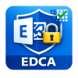
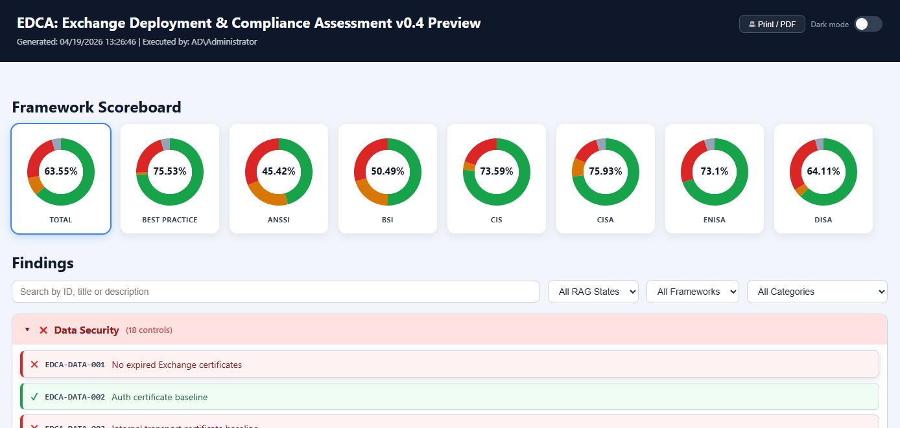
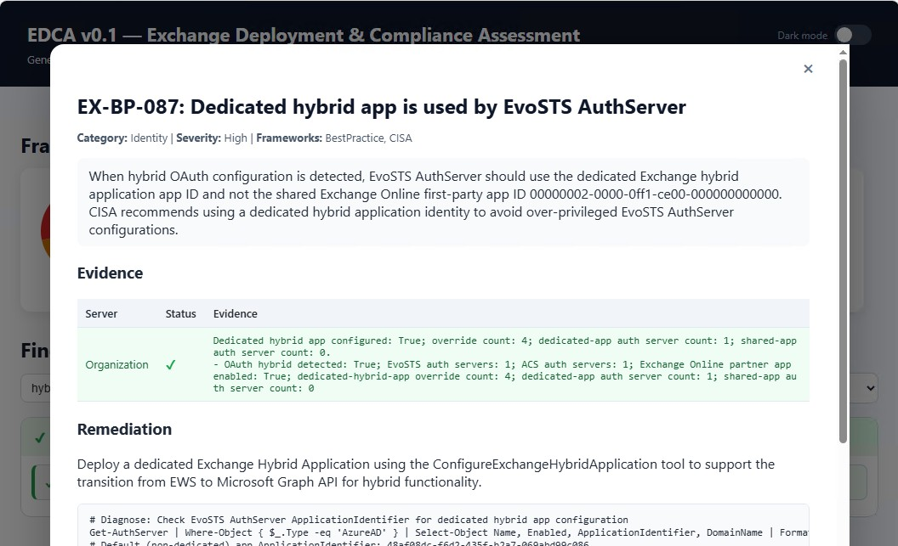

#  Exchange Deployment & Compliance Assessment

PowerShell-based tool that collects Exchange on-premises deployment data, evaluates it against best practices and compliance controls, and produces an interactive HTML report ([sample](https://michelderooij.github.io/EDCA/report_sample.html)). Supports Exchange 2016, Exchange 2019, and Exchange SE.

## Key Features

- Supports Exchange 2016, Exchange 2019, and Exchange SE (Subscription Edition).
- Evaluates controls against Best Practices and 7 compliance frameworks: [ANSSI](#frameworks) 🇫🇷, [BSI](#frameworks) 🇩🇪, [CIS](#frameworks) 🇺🇸, [CISA](#frameworks) 🇺🇸, [DISA](#frameworks) 🇺🇸, [ISM](#frameworks) 🇦🇺, and [NIS2](#frameworks) 🇪🇺.
- Interactive HTML report with per-framework scores, color-coded findings, search, and filters.
- Evidence appears in full when you print or save the report to PDF (browser print → Save as PDF).
- Collect data from all discovered Exchange servers, or target a specific set with `-Servers`.
- Run collect (`-Collect`) and report (`-Report`) as separate phases, or together in one step.
- Generates an optional sample remediation script for all failed controls ([sample](remediation_sample.ps1)).
- `-Update` switch downloads the latest Exchange build catalog from GitHub.
- Hide skipped controls on demand (for example, Edge Transport controls when no Edge Transport server is present).
- Report supports dark mode.

## Installation

### From the PowerShell Gallery (recommended)

```powershell
Install-Module -Name EDCA
```

Once installed, import and run:

```powershell
Import-Module EDCA
Invoke-EDCA -Servers EX01,EX02
```

### From GitHub

1. Clone or download this repository.
2. If downloaded as a ZIP, unblock the scripts before running:
   ```powershell
   Get-ChildItem -Path .\EDCA -Recurse -File | Unblock-File
   ```
3. Import the module or run `EDCA.ps1` from the `EDCA` folder.

#### Module import from source

```powershell
Import-Module .\EDCA\EDCA.psd1
Invoke-EDCA -Servers EX01,EX02
```

All parameters are the same as `EDCA.ps1`. The `EDCA.ps1` wrapper script continues to work unchanged.

## Requirements

- PowerShell 5.1 or later.
- Run EDCA under an account that has Exchange and AD administrative access.
- EDCA does not require the Exchange Management Shell or the Active Directory module.
- When you omit `-Servers`, EDCA auto-discovers Exchange servers via Active Directory (the "Exchange Servers" security group) and must be able to reach a domain controller.
- EDCA connects to Exchange servers over HTTP (port 80) using remote PowerShell, queries Global Catalog domain controllers over LDAPS (port 3269), and reads CPU details via WS-MAN (port 5985).
- To collect data from Edge Transport servers, see [Edge Transport Servers](#edge-transport-servers) below.
- **When running EDCA on an Exchange Mailbox server**, your PowerShell session must be **elevated** (Run as Administrator). UAC token filtering blocks the remote PowerShell connection over port 80 for non-elevated sessions.

## Required Permissions

The account running EDCA needs the following permissions. Permissions that affect core collection are noted; permissions needed for specific controls cause those controls to report **Fail** when missing.

| Permission | Scope | Required for |
|---|---|---|
| Exchange **Organization Management** or **View-Only Organization Management** role | Exchange organization | Core collection — Exchange cmdlets (`Get-ExchangeServer`, `Get-OrganizationConfig`, `Get-Mailbox`, and all other Exchange management commands). |
| **Local Administrator** | Each Exchange server | Core collection — WMI queries for OS, hardware, volume/disk, BitLocker state, network configuration; reading local registry values (TLS, update metadata). |
| **Active Directory read** (Domain User is sufficient) | AD forest/domain | Core collection — LDAP RootDSE queries for forest and domain functional level; AD site enumeration; Exchange server AD site lookup. |
| **Local Administrator** | Each Domain Controller / Global Catalog in the Exchange AD site | Exchange-to-DC/GC core ratio — WMI `Win32_Processor` on domain controller servers. |

> **Note:** Missing permissions cause affected controls to report **Fail** rather than *Unknown*, so access gaps appear as findings in the report.

## Usage

```powershell
# Collect + analysis + HTML for all Exchange servers in current environment
Invoke-EDCA

# Collect + analysis + HTML (both phases run by default)
Invoke-EDCA -Servers EXCH01,EXCH02

# Collect + analysis + HTML for the local server only (Edge Transport)
Invoke-EDCA -Local

# Collect only (no report), limit parallel collection jobs
Invoke-EDCA -Collect -Servers EXCH01,EXCH02 -ThrottleLimit 2

# Collect with remediation script generation
Invoke-EDCA -Servers EXCH01,EXCH02 -RemediationScript

# Report mode using files from previously collected server and organization files
Invoke-EDCA -Report

# Analyse only against Best Practice (contains space, thus needs quotes) and CIS controls
Invoke-EDCA -Servers EXCH01,EXCH02 -Framework 'Best Practice',CIS

```

## Edge Transport Servers

Edge Transport servers are not domain-joined, so EDCA running on a Mailbox server cannot reach them directly. To assess an Edge Transport server, run EDCA locally on the Edge server and copy the collected data file to a Mailbox server for analysis and reporting.

**Step 1 — Collect on the Edge Transport server**

Log on to the Edge Transport server and run EDCA with `-Collect` and `-Local`:

```powershell
Invoke-EDCA -Collect -Local
```

This writes a `<fqdn>_<timestamp>.json` file to the `Data` folder.

**Step 2 — Copy the data file to a Mailbox server**

Copy the JSON file produced in Step 1 to the `Data` folder of the EDCA installation on a Mailbox server (or wherever you run analysis).

**Step 3 — Run analysis and generate the report**

On the Mailbox server, run the normal collect-and-report flow (or just `-Report` if you already have Mailbox-server data). EDCA discovers all JSON files in `Data` and includes the Edge server in the analysis:

```powershell
# Collect from Mailbox servers and report, including the copied Edge data file
Invoke-EDCA

# Or, if Mailbox-server data is already collected, just generate the report
Invoke-EDCA -Report
```

EDCA assesses Edge-specific controls (anti-spam agents, recipient validation, blank-sender blocking, send connector TLS, protocol logging, and SMTP certificate assignment) only for servers whose data is present. The report marks Edge servers with an **EDGE** badge and lists any Edge servers detected in the organization topology that were not collected.

## Output

Collection and Analysis files are written to `Data`:

- `<fqdn>_<timestamp>.json`: Per-server collected data (machine-readable).
- `<OrganizationId>_<timestamp>.json`: Organization-wide collected data shared across all servers in the run.
- `analysis_*.json`: Control evaluation output.

Report and remediation files are written to `Output`:

- `report_*.html`: Interactive assessment report.
- `remediation_*.ps1`: Optional generated remediation script.

## Frameworks

EDCA evaluates controls against the following compliance frameworks. Each control in `Controls/` is tagged with one or more framework identifiers; the HTML report displays a separate score for each.

| Framework | Official Reference(s) | Version / Date | Official URL | License |
|---|---|---|---|---|
| **Best Practice** | Common best practices for Exchange Server deployments, including [CSS Exchange](https://microsoft.github.io/CSS-Exchange/) | — | — | — |
| **ANSSI** 🇫🇷 | [Mise en œuvre sécurisée d'un serveur Windows](https://messervices.cyber.gouv.fr/guides/mise-en-oeuvre-securisee-dun-serveur-windows)<br>[Recommandations de sécurité relatives à TLS](https://messervices.cyber.gouv.fr/guides/recommandations-de-securite-relatives-tls)<br>[Sécuriser la journalisation dans un environnement Microsoft AD](https://messervices.cyber.gouv.fr/guides/securiser-la-journalisation-dans-un-environnement-microsoft-active-directory)<br>[Transition post-quantique de TLS 1.3](https://messervices.cyber.gouv.fr/guides/Transition-post-quantique-protocole-TLS-1-3) | v1.0 · Oct 2025<br>v1.2 · Mar 2020<br>Jan 2022<br>Feb 2026 | [messervices.cyber.gouv.fr](https://messervices.cyber.gouv.fr/) | Free to access |
| **BSI** 🇩🇪 | [IT-Grundschutz-Kompendium Edition 2023](https://www.bsi.bund.de/DE/Themen/Unternehmen-und-Organisationen/Standards-und-Zertifizierung/IT-Grundschutz/IT-Grundschutz-Kompendium/it-grundschutz-kompendium_node.html)<br>Modules: SYS.1.1 · SYS.1.2.3 · APP.2.2 · APP.5.2 | Edition 2023<br>February 2023 | [bsi.bund.de](https://www.bsi.bund.de/) | © BSI — free to download |
| **CIS** 🇺🇸 | [CIS Microsoft Exchange Server 2019 Benchmark](https://www.cisecurity.org/benchmark/microsoft_exchange_server)<br>[CIS Microsoft Windows Server 2019/2022 Benchmark](https://www.cisecurity.org/benchmark/microsoft_windows_server)<br>[CIS Controls v8](https://www.cisecurity.org/insights/white-papers/cis-controls-v8) | v1.0.0<br>v4.0.0 (2019) · v5.0.0 (2022)<br>v8 | [cisecurity.org](https://www.cisecurity.org/benchmark/microsoft_exchange_server) | Free, non-commercial use only |
| **CISA** 🇺🇸 | [Microsoft Exchange Server Security Best Practices Guide](https://www.cisa.gov/sites/default/files/publications/CSI_MS_Exchange_Security_Best_Practices_Final.pdf)<br>[Advisory AA21-062A: Mitigate Exchange Server Vulnerabilities](https://www.cisa.gov/news-events/cybersecurity-advisories/aa21-062a)<br>[Binding Operational Directive 18-01](https://www.cisa.gov/binding-operational-directive-18-01)<br>[Known Exploited Vulnerabilities Catalog](https://www.cisa.gov/known-exploited-vulnerabilities-catalog) | 2021<br>March 2021<br>October 2017<br>Ongoing | [cisa.gov](https://www.cisa.gov/) | Public domain (US Government) |
| **DISA** 🇺🇸 | [Microsoft Exchange 2019 Mailbox Server STIG](https://public.cyber.mil/stigs/downloads/)<br>[Microsoft Exchange 2016 Mailbox Server STIG](https://public.cyber.mil/stigs/downloads/) | 2025-05-14<br>2023-12-18 | [public.cyber.mil/stigs](https://public.cyber.mil/stigs/downloads/) | Public domain (US Government) |
| **ISM** 🇦🇺 | [Information Security Manual](https://www.cyber.gov.au/resources-business-and-government/essential-cyber-security/ism), published by Australian Signals Directorate (ASD) | Current | [cyber.gov.au](https://www.cyber.gov.au/) | Free to access (Australian Government) |
| **NIS2** 🇪🇺🇳🇱 | [NIS2 Directive (EU) 2022/2555](https://eur-lex.europa.eu/eli/dir/2022/2555/oj)<br>[NCSC-NL TLS Guidelines 2025-05](https://www.ncsc.nl/transport-layer-security/ICT-beveiligingsrichtlijnen-voor-TLS) | December 2022<br>April 2026 | [eur-lex.europa.eu](https://eur-lex.europa.eu/eli/dir/2022/2555/oj)<br>[ncsc.nl](https://www.ncsc.nl/) | Open (EU law)<br>Free (Dutch Government) |

## Screenshots

**Report dashboard** — framework scores (Total, Best Practice, ANSSI, BSI, CIS, CISA, DISA, ISM, NIS2) with color-coded donut charts, and findings grouped by category with RAG indicators, search, and filters:



**Control detail panel** — per-control description, evidence table (subject, status, evidence text), remediation guidance, and optional script template:



## Notes

- Compliance trend widget only shows in reports when there are 2 or more data points.
- Some controls appear to overlap (e.g., SEC-034 and TLS-044–047), but they come from different frameworks
  and have different scopes. TLS-044–047 map to Best Practice and DISA, while SEC-034 maps to DISA and BSI.
  Some frameworks also define role-specific controls (e.g., Edge Transport). As a result, the topics may overlap,
  but the control definitions do not—so they aren’t merged.

## Changelog

See [CHANGELOG.md](CHANGELOG.md) for the full version history.
